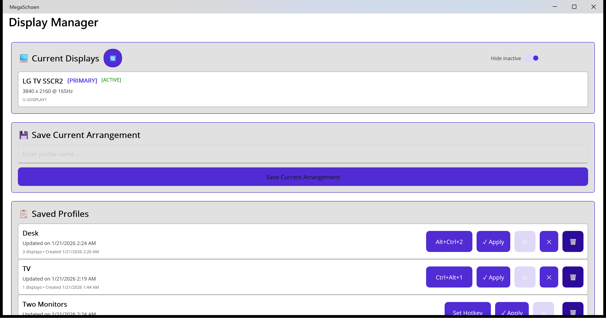

# MegaSchoen

Dumping ground for various cross-platform utilities. Currently there's just one function: Display Manager.

## Display Manager

A Windows display profile manager that lets you save and quickly switch between different monitor configurations.



## Features

- **Save Display Profiles** - Capture your current monitor arrangement including resolution, position, refresh rate, and rotation
- **Quick Profile Switching** - Apply saved profiles with one click to switch between configurations (e.g., "Work" vs "Gaming" vs "TV Only")
- **Global Hotkeys** - Assign keyboard shortcuts (e.g., Ctrl+Alt+1) to instantly switch profiles
- **System Tray** - Runs in the background with quick access to profiles from the tray icon
- **Start with Windows** - Optional startup registration to have hotkeys ready when you log in
- **Single Instance** - Only one instance runs; launching again brings the existing window to focus
- **Multi-GPU Support** - Works with displays connected to different graphics adapters
- **Extend Mode** - Properly restores extended desktop layouts (not mirrored)
- **Portrait Mode Support** - Preserves monitor rotation settings

## Use Cases

- Switch between a multi-monitor work setup and a single TV for gaming/media
- Toggle portrait monitors on/off while preserving rotation
- Quickly disable secondary displays for screen sharing
- Restore complex multi-monitor arrangements after disconnecting displays

## Installation

Download the latest release or build from source.

### Building from Source

**Requirements:**
- Visual Studio 2022+ with C++ and .NET MAUI workloads
- Windows 10 SDK
- .NET 10

**Important:** Always use MSBuild with `-p:Platform=x64` - the native DLL requires 64-bit.

```powershell
# Build the entire solution
MSBuild.exe MegaSchoen.sln -p:Configuration=Debug -p:Platform=x64

# Or build just the CLI
MSBuild.exe DisplayManagerCLI/DisplayManagerCLI.csproj -p:Configuration=Debug -p:Platform=x64
```

Do NOT use `dotnet build` - it cannot build the native C++ dependency.

## Usage

### GUI Application

Launch `MegaSchoen.exe` for the graphical interface:

1. **Current Displays** - Shows all connected monitors with their current settings
2. **Save Current Arrangement** - Enter a name and save your current display configuration
3. **Saved Profiles** - Lists all saved profiles with options to:
   - **Set Hotkey** - Assign a global hotkey (e.g., Ctrl+Alt+1) to this profile
   - **Apply** - Switch to this display configuration
   - **Overwrite** - Update the profile with current settings
   - **Delete** - Remove the profile
4. **Settings** - Configure minimize-to-tray and start-with-Windows options

**System Tray:** Closing the window minimizes to the system tray. Right-click the tray icon for quick profile access or to exit.

### Command Line Interface

```powershell
DisplayManagerCLI.exe list              # List all displays
DisplayManagerCLI.exe save "My Profile" # Save current config as a profile
DisplayManagerCLI.exe load "My Profile" # Load and apply a saved profile
DisplayManagerCLI.exe profiles          # List all saved profiles
DisplayManagerCLI.exe raw               # Show raw JSON display data
```

Profiles are stored in `%APPDATA%\MegaSchoen\configs.json`.

## Project Structure

- **DisplayManagerNative** (C++ DLL) - Windows CCD API wrapper for display enumeration and configuration
- **DisplayManager.Core** (.NET 10) - Managed wrapper with profile management
- **DisplayManagerCLI** (.NET 10) - Command-line interface
- **MegaSchoen** (MAUI) - Cross-platform GUI (currently Windows-only for display features)

## How It Works

MegaSchoen uses the Windows [CCD (Connecting and Configuring Displays) API](https://learn.microsoft.com/en-us/windows-hardware/drivers/display/ccd-apis) to:

1. Query all display paths via `QueryDisplayConfig`
2. Store configuration data (resolution, position, refresh rate, rotation) per monitor
3. Apply configurations via `SetDisplayConfig` with unique source IDs for extend mode

Monitors are identified by their hardware device path, which remains stable across reboots.

## License

MIT
